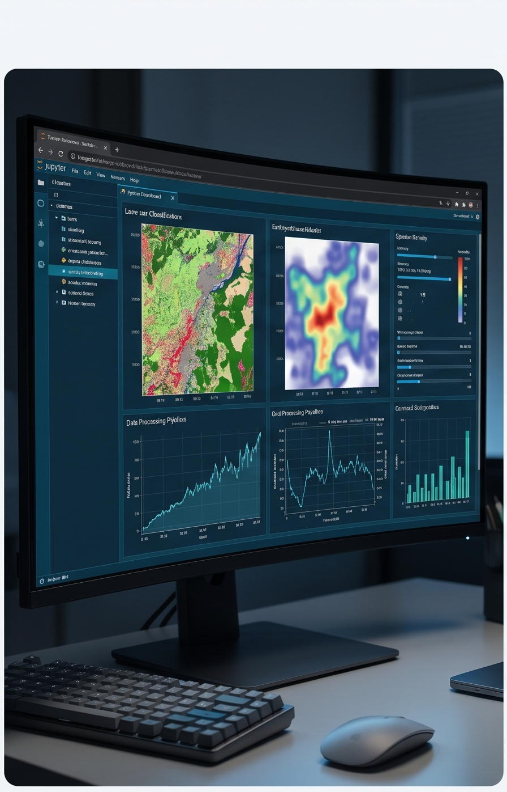
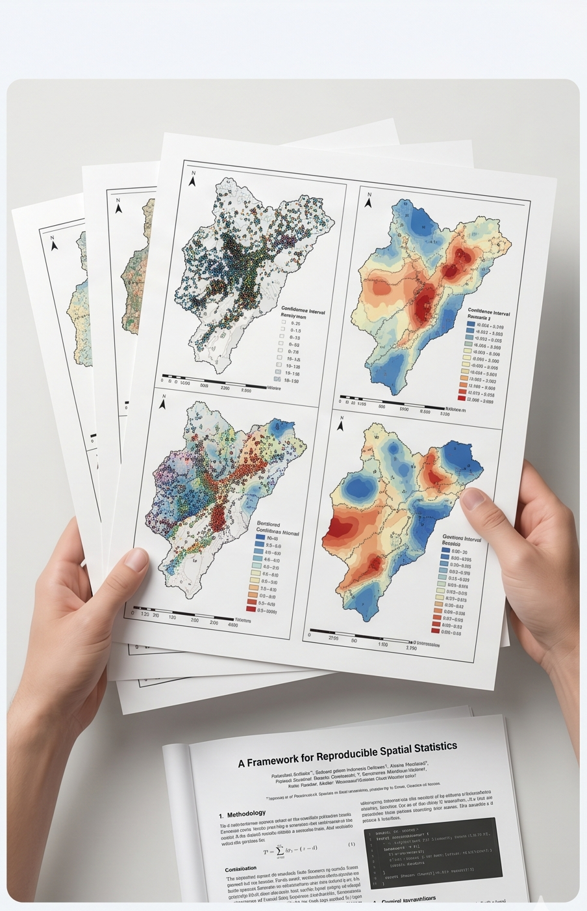
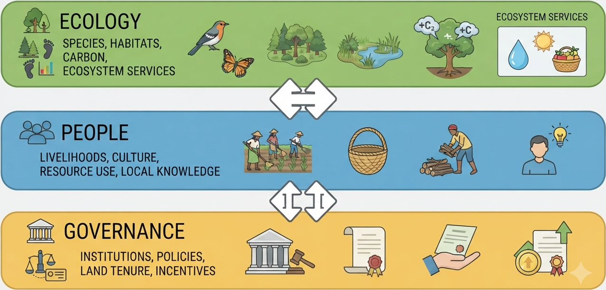

::::::::::::::::::: eg-page

:::: {#hero .eg-hero .eg-hero-tint-dark .eg-hero-center .eg-hero-middle style="--eg-hero-img:url('images/bannerNew.jpg');"}
::: eg-wrap
<!--[Prime Geospatial]{.eg-eyebrow}-->

# ArdhiLytics

## Bridging the Gap Between Data and Discovery

[Explore Our Services](services.qmd){.eg-btn .eg-btn-solid}
:::
::::

:::::: {#about .eg-section .eg-whoweare-dark}
::::: eg-wrap
:::: eg-who-grid

::: eg-who-title
[Who we are]{.eg-eyebrow}

## Turning landscape data into trusted intelligence for sustainable futures.
:::

::: eg-who-desc
::: eg-intro-lede

## Prime Geospatial

PrimeGeo is a science-driven spatial analytics and environmental intelligence firm.

We transform complex landscape data into actionable evidence that helps governments, conservation organizations, investors, project developers, and communities make confident decisions. By integrating satellite observation, advanced spatial modeling, field-based data, and social-ecological insights, we deliver audit-ready intelligence that connects environmental outcomes with real-world impact.

Built on a foundation of scientific rigor, transparency, and local relevance, we work at the intersection of conservation, climate, and sustainable development. Our expertise spans carbon measurement and verification, land-use change modeling, landscape ecology, resilience assessment, and evidence-based planning.
We bridge spatial and social science, combining ecological data, community knowledge, and governance dynamics to provide a complete understanding of how landscapes function and change over time.

From project design and baseline assessments to monitoring, verification, and impact evaluation, we help our partners move beyond assumptions and make decisions backed by credible, measurable evidence.
:::

::: {.eg-hero-ctas}
[Learn more about us](about.qmd#about){.eg-btn .eg-btn-outline} [Learn more about the team](people.qmd#people){.eg-btn .eg-btn-outline}
:::
:::

::::

<!--::: eg-chip-row
[Remote Sensing]{.eg-chip} [Landscape & Forest Ecology]{.eg-chip} [Spatiotemporal Modeling]{.eg-chip} [Ecological Modeling]{.eg-chip} [Land-Use Mapping & Modeling]{.eg-chip} [Social-Ecological Systems]{.eg-chip}
:::-->
:::::
::::::

:::::::::: {#what-we-do .eg-section .eg-services}
::::::::: eg-wrap
::: eg-sec-head
[What we do]{.eg-eyebrow}

## Five layers of analysis — one landscape.

A quick look at the stack. Each layer is available on its own, or combined into a full landscape assessment.
:::

::::::: eg-teaser-grid

::: eg-teaser-card
::: eg-teaser-photo

:::

::: eg-teaser-icon
<i class="bi bi-clipboard-data"></i>
:::

::: eg-teaser-body
### Digital MRV & Carbon Verification

[High-integrity, audit-ready carbon intelligence that you can bank on.]{.eg-teaser-desc}

[View](services-geospatial.qmd#services){.eg-teaser-link}
:::
:::

::: eg-teaser-card
::: eg-teaser-photo

:::

::: eg-teaser-icon
<i class="bi bi-map"></i>
:::

::: eg-teaser-body
### Land-Use & Land-Cover Change Modeling

[Co-designing the future of your landscape.]{.eg-teaser-desc}

[View](services-geospatial.qmd#services){.eg-teaser-link}
:::
:::

::: eg-teaser-card
::: eg-teaser-photo

:::

::: eg-teaser-icon
<i class="bi bi-tree"></i>
:::

::: eg-teaser-body
### Landscape Connectivity & Conservation Planning

[Bridging the gap between ecological integrity and human prosperity.]{.eg-teaser-desc}

[View](services-geospatial.qmd#services){.eg-teaser-link}
:::
:::

::: eg-teaser-card
::: eg-teaser-photo

:::

::: eg-teaser-icon
<i class="bi bi-people"></i>
:::

::: eg-teaser-body
### Social-Ecological Systems & Resilience Assessment

[Where land, climate, and community governance converge.]{.eg-teaser-desc}

[View](services-geospatial.qmd#services){.eg-teaser-link}
:::
:::

::: eg-teaser-card
::: eg-teaser-photo

:::

::: eg-teaser-icon
<i class="bi bi-mortarboard"></i>
:::

::: eg-teaser-body
### Technical Consulting & Capacity Building

[Translating complex spatial data into actionable, team-led expertise.]{.eg-teaser-desc}

[View](services-geospatial.qmd#services){.eg-teaser-link}
:::
:::

:::::::
:::::::::
::::::::::

:::::: {#about .eg-section}
::::: eg-wrap
::: eg-sec-head
[Our core competencies]{.eg-eyebrow}

## Trans-disciplinary engagements
:::

<!-- CORE COMPETENCIES SECTION -->
::: {.column-page style="padding-top: 1.5rem; padding-bottom: 1.5rem;"}

<!--<h2 style="font-size: 2.25rem; font-weight: 700; color: #2A5A5C; margin-bottom: 2.5rem; text-align: center; padding-bottom: 10px;">Our Core Competencies</h2>-->

::: {.grid}

::: {.g-col-12 .g-col-md-4 .competency-card}

### Spatial Data Science

Advanced R and Python workflows for raster analysis and complex data visualization.
:::

::: {.g-col-12 .g-col-md-4 .competency-card}

### Ecological Modeling

Theoretical landscape ecology, focusing on the critical distinction between configuration and spatial patterns.
:::

::: {.g-col-12 .g-col-md-4 .competency-card}

### Statistical Rigor

Expertise in spatial statistics and reproducible research practices to ensure scientific integrity.

:::

:::

:::

:::::
::::::

:::: {#social-ecological .eg-section .eg-ses-dark}
::: eg-wrap
::: eg-ses-card

::: eg-sec-head
[Our approach]{.eg-eyebrow}

## Social-ecological integration

[Environmental Problems Don't Exist in Isolation]{.eg-ses-tagline}
:::

::: eg-ses-intro-box
At Prime Geospatial, we recognize that environmental challenges are never purely ecological, they are inextricably linked to social, economic, and governance dynamics. True sustainability emerges only when rigorous science is grounded in the realities of the communities who live, work, and depend on the land.

By fusing spatial analytics, ecological modeling, and community-informed social-ecological systems thinking, we design interventions that are not just environmentally effective, but socially viable, locally supported, and built to endure.
:::

::: eg-ses-body
::: eg-ses-image

:::

::: eg-ses-points
We map the intersection where these critical dimensions meet:

- **Ecology**: We quantify species presence, habitat quality, carbon storage, and critical ecosystem services.
- **People**: We account for livelihoods, cultural values, resource dependency, and the wealth of local knowledge that shapes landscape use.
- **Governance**: We analyze the institutions, policies, land tenure systems, and economic incentives that dictate how land is managed and protected.

::: eg-ses-cta
[Why social-ecological integration matters →](about-geospatial_3.qmd#about){.eg-btn .eg-btn-solid}
:::
:::
:::

:::
:::
::::

:::::: {#impact .eg-section .eg-impact}
::::: eg-wrap
::: eg-sec-head
[Community impact]{.eg-eyebrow}

## Empowering people, institutions, and communities.
:::

::: eg-impact-lede
At PrimeGeo, we believe that scientific knowledge creates the greatest impact when it is shared, accessible, and actionable. As part of our commitment to environmental stewardship and community service, we actively support conservation practitioners, local institutions, and the broader public through training, open environmental data, and rapid-response decision support tools.
:::

::: eg-impact-grid
::: eg-impact-card
[Capacity building]{.eg-num}

### Conservation professionals

We provide practical training, workshops, and mentorship in GIS, remote sensing, environmental monitoring, spatial modeling, and social-ecological assessment — strengthening local expertise so practitioners can make evidence-based conservation and land management decisions.

::: {.eg-ses-cta}
[See more about our trainings →](about-geospatial_3.qmd#about){.eg-btn .eg-btn-solid}
:::
:::

::: eg-impact-card
[Open data]{.eg-num}

### Knowledge access

Access to reliable environmental information is essential for informed decision-making. We work to make environmental data, maps, indicators, and analytical tools publicly accessible, helping researchers, communities, NGOs, and policymakers understand and manage their landscapes.

::: {.eg-ses-cta}
[See available data →](about-geospatial_3.qmd#about){.eg-btn .eg-btn-solid}
:::
:::

::: eg-impact-card
[Rapid response]{.eg-num}

### Disaster intelligence

When environmental emergencies occur, timely information can save lives, livelihoods, and ecosystems. We develop and deploy rapid-response mapping and monitoring tools supporting preparedness, impact assessment, and recovery for floods, droughts, wildfires, and land degradation.

::: {.eg-ses-cta}
[See available tools →](about-geospatial_3.qmd#about){.eg-btn .eg-btn-solid}
:::

:::
:::
:::::
::::::

:::::: {#contact .eg-section .eg-contact}
::::: eg-contact-wrap
::: eg-contact-left
## Have a landscape that needs a closer look?

Tell us what you're trying to prove, protect, or plan for. Let us discuss which layers apply.
:::

::: eg-contact-box
[EMAIL]{.eg-mono-label}

[hello\@equatorgeospatial.com](mailto:hello@equatorgeospatial.com){.eg-email}

[BASED IN]{.eg-mono-label}

[Nairobi, Kenya — serving East Africa]{.eg-email-sub}

[Send us a brief](mailto:hello@equatorgeospatial.com){.eg-btn .eg-btn-solid}
:::
:::::
::::::
:::::::::::::::::::
