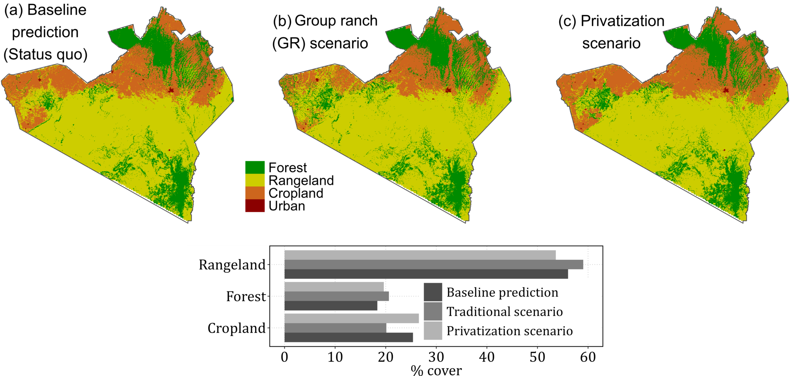

<header class="eg-hero">

[Layer 02 — Land-use modeling]{.eg-eyebrow}

# Land-Use & Land-Cover Change Modeling

[We simulate how a landscape is likely to change under different policies and pressures, so decision-makers can see the consequences of a plan before it reaches the ground.]{.eg-lede}

[Talk to us about your landscape](contact2.qmd){.eg-btn .eg-btn-solid} [Back to services](services-geospatial3.qmd#services){.eg-btn .eg-btn-outline}

</header>

::::::::::::::::::: eg-page

:::::: {#how-it-works .eg-section}
::::: eg-wrap

::: eg-sec-head
[How it works]{.eg-eyebrow}

## From satellite records to future scenarios
:::

::: eg-intro-lede
We combine satellite-derived land-cover records with the factors that drive change on the ground — rainfall, terrain, proximity to existing land uses, and land tenure — to reconstruct how a landscape has shifted over time and where it is heading.

The same approach lets us test alternative futures. Run the model forward under today's policy, then again under a different tenure or management approach, and compare what happens to forest, rangeland, and cropland in each case.
:::

:::::
::::::

:::::: {#scenario-figure .eg-section}
::::: eg-wrap

<figure style="margin:0;">

<figcaption class="eg-photo-caption" style="margin-top:14px;">
Simulated land cover under three governance scenarios for a landscape in southern Kenya. Comparing a current-policy baseline against group-ranch and privatized tenure shows how a single policy choice reshapes forest, rangeland, and cropland extent, years before it happens on the ground.
</figcaption>
</figure>

:::::
::::::

:::::: {#why-it-matters .eg-section .eg-services}
::::: eg-wrap

::: eg-sec-head
[Why it matters]{.eg-eyebrow}

## Built for decisions, not just diagnostics
:::

::::: eg-values-grid

::: eg-value-item
### See trade-offs before they happen
Compare how different tenure and management choices reshape a landscape, so trade-offs are visible during planning rather than after implementation.
:::

::: eg-value-item
### Target limited resources
Pinpoint the zones where competing land uses are most likely to collide, so conservation, agriculture, and monitoring effort goes where it matters most.
:::

::: eg-value-item
### Ground decisions in evidence
Replace assumption-driven debate with a shared, transparent picture of the landscape — useful for engaging communities, investors, and government partners alike.
:::

::: eg-value-item
### Test policy before committing
Explore how a proposed tenure or governance change might play out, without waiting years to find out.
:::

:::::

:::::
::::::

:::::: {#confidence .eg-section}
::::: eg-wrap

::: eg-bridge-grid

::: eg-bridge-card
[Starting point]{.eg-bridge-label}

### Checked against reality

Our models are validated against observed, real-world land-cover change before they're used for forward-looking scenarios.
:::

::: eg-bridge-arrow
→
:::

::: eg-bridge-card
[What you get]{.eg-bridge-label}

### A picture planners can trust

A forward-looking view of the landscape that has been tested against what actually happened, not just calibrated to look reasonable.
:::

:::

:::::
::::::

:::::: {#contact .eg-section .eg-contact}
::::: eg-contact-wrap

::: eg-contact-left
## Have a landscape that needs this kind of clarity?

Tell us the policy or planning question you're facing. We'll tell you what the land is likely to do next.
:::

::: eg-contact-box
[EMAIL]{.eg-mono-label}

[hello\@equatorgeospatial.com](mailto:hello@equatorgeospatial.com){.eg-email}

[Send us a brief](mailto:hello@equatorgeospatial.com){.eg-btn .eg-btn-solid}
:::

:::::
::::::

:::::::::::::::::::
