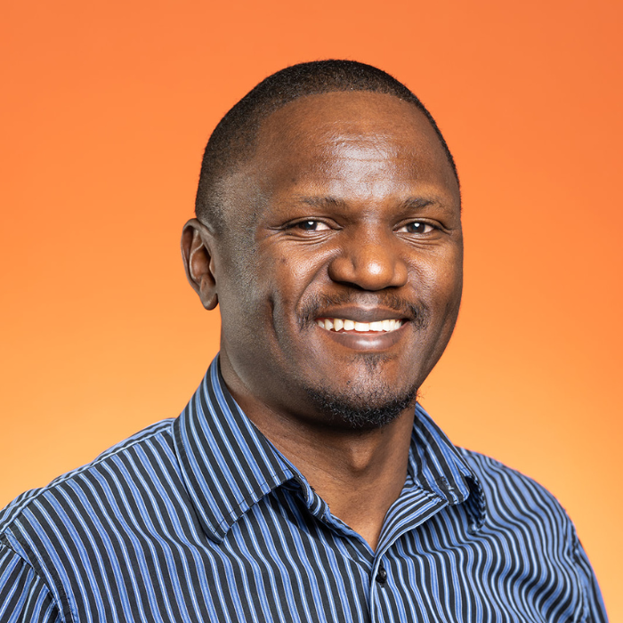
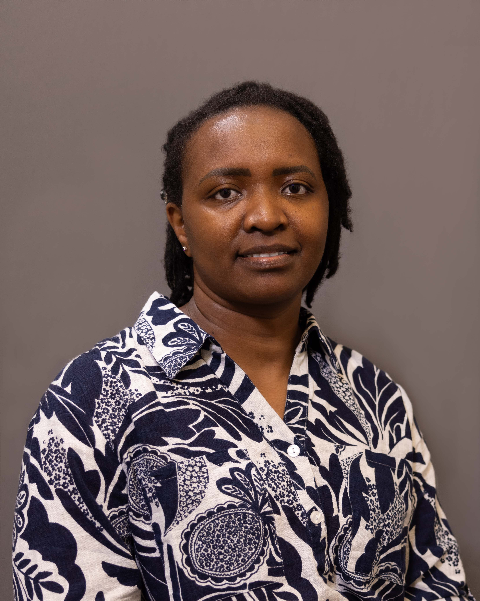

::::::::::::::::::: eg-page

:::: {#hero .eg-hero .eg-hero-tint-dark .eg-hero-center .eg-hero-middle style="--eg-hero-img:url('images/nrkGraze.jpg');"}
::: eg-wrap
<!--[About us]{.eg-eyebrow}-->

# Past and ongoing projects

## We deliver data-driven intelligence where it matters most.

:::
::::

:::::: {#history .eg-section .eg-history}
::::: eg-wrap
:::: eg-history-grid

::: eg-position-map
```{r}
#| label: prime-geospatial-map
#| echo: false
#| message: false
#| warning: false

library(leaflet)

# Define your custom color palette (using your brand variables)
# Replace these hex codes with your CSS variable values if needed
brand_color <- "#6FCF87" 

# Create the map
leaflet(height = 500) %>%
  # Use CartoDB Positron for a clean, scientific, "data-first" look
  addProviderTiles(providers$CartoDB.Positron) %>%
  
  # Center on your primary region (e.g., East Africa)
  setView(lng = 37.0, lat = -1.0, zoom = 6) %>%
  
  # Add a custom marker/circle with branding
  addCircleMarkers(
    lng = 36.8219, lat = -1.2921,
    color = brand_color,
    fillOpacity = 0.8,
    radius = 8,
    stroke = FALSE,
  )

```
:::


::: eg-history-text
[Our story]{.eg-eyebrow}

## Three researchers, one landscape-sized problem

Prime Geospatial began as a collaborative effort among three long-time friends and doctoral researchers. Today, Prime Geospatial serves as the vital link between raw computing and actionable ground truth.

We handle the heavy lifting — accessing, processing, maintaining, and analyzing complex datasets — while uniquely providing the expert interpretation and essential validation framework that automated geospatial models lack.

We turn raw, intimidating data into clear, verified, and deeply understood spatial insights that drive smarter, faster, and more cost-effective decision-making.
:::

::::
:::::
::::::


:::::: {#founders .eg-section .eg-founders}
::::: eg-wrap
::: eg-sec-head
[Meet the team]{.eg-eyebrow}

## The founders
:::

::: eg-founder-grid

::: eg-founder-card
::: eg-founder-photo

:::

### Dr. Donald Akanga

[Co-Founder]{.eg-founder-role}

[Geospatial Data Scientist and Landscape Ecologist specializing in arid and semi-arid landscape (ASAL) management, land-use modeling, and regenerative landscape science.]{.eg-founder-expertise}

::: eg-founder-social
[<i class="bi bi-linkedin"></i>](https://www.linkedin.com/){target="_blank"}
[<i class="bi bi-envelope"></i>](mailto:hello@equatorgeospatial.com)
:::
:::

::: eg-founder-card
::: eg-founder-photo

:::

### Dr. Susan Kotikot

[Co-Founder]{.eg-founder-role}

[Geospatial Data Scientist and Landscape Ecologist specializing in arid and semi-arid landscape (ASAL) management, land-use modeling, and regenerative landscape science.]{.eg-founder-expertise}

::: eg-founder-social
[<i class="bi bi-linkedin"></i>](https://www.linkedin.com/in/susankotikot/){target="_blank"}
[<i class="bi bi-envelope"></i>](mailto:hello@equatorgeospatial.com)
:::
:::

::: eg-founder-card
::: eg-founder-photo

:::

### Dr. Dan Wanyama

[Co-Founder]{.eg-founder-role}

[Geospatial Geospatial Scientist and Environmental Geographer specializing in forest and agricultural land-use change dynamics, climate variability and human-environment interactions, and socio-ecological vulnerability.]{.eg-founder-expertise}

::: eg-founder-social
[<i class="bi bi-linkedin"></i>](https://www.linkedin.com/){target="_blank"}
[<i class="bi bi-envelope"></i>](mailto:hello@equatorgeospatial.com)
:::
:::

:::
:::::
::::::


:::::: {#founders .eg-section .eg-founders}
::::: eg-wrap
::: eg-sec-head
[Meet the team]{.eg-eyebrow}

## The founders
:::

::: eg-founder-grid

::: eg-founder-card
::: eg-founder-photo

:::

### Dr. Donald Akanga

[Co-Founder]{.eg-founder-role}

[Geospatial Data Scientist and Landscape Ecologist specializing in arid and semi-arid landscape (ASAL) management, land-use modeling, and regenerative landscape science.]{.eg-founder-expertise}

::: eg-founder-social
[<i class="bi bi-linkedin"></i>](https://www.linkedin.com/){target="_blank"}
[<i class="bi bi-envelope"></i>](mailto:hello@equatorgeospatial.com)
:::
:::

::: eg-founder-card
::: eg-founder-photo

:::

### Dr. Susan Kotikot

[Co-Founder]{.eg-founder-role}

[Geospatial Data Scientist and Landscape Ecologist specializing in arid and semi-arid landscape (ASAL) management, land-use modeling, and regenerative landscape science.]{.eg-founder-expertise}

::: eg-founder-social
[<i class="bi bi-linkedin"></i>](https://www.linkedin.com/in/susankotikot/){target="_blank"}
[<i class="bi bi-envelope"></i>](mailto:hello@equatorgeospatial.com)
:::
:::

::: eg-founder-card
::: eg-founder-photo

:::

### Dr. Dan Wanyama

[Co-Founder]{.eg-founder-role}

[Geospatial Geospatial Scientist and Environmental Geographer specializing in forest and agricultural land-use change dynamics, climate variability and human-environment interactions, and socio-ecological vulnerability.]{.eg-founder-expertise}

::: eg-founder-social
[<i class="bi bi-linkedin"></i>](https://www.linkedin.com/){target="_blank"}
[<i class="bi bi-envelope"></i>](mailto:hello@equatorgeospatial.com)
:::
:::

:::
:::::
::::::


:::::: {#contact .eg-section .eg-contact}
::::: eg-contact-wrap
::: eg-contact-left
## Have a landscape that needs a closer look?

Tell us what you're trying to prove, protect, or plan for. Let us discuss which layers apply.
:::

::: eg-contact-box
[EMAIL]{.eg-mono-label}

[hello\@equatorgeospatial.com](mailto:hello@equatorgeospatial.com){.eg-email}

[BASED IN]{.eg-mono-label}

[Nairobi, Kenya — serving East Africa]{.eg-email-sub}

[Send us a brief](mailto:hello@equatorgeospatial.com){.eg-btn .eg-btn-solid}
:::
:::::
::::::


:::::::::::::::::::
