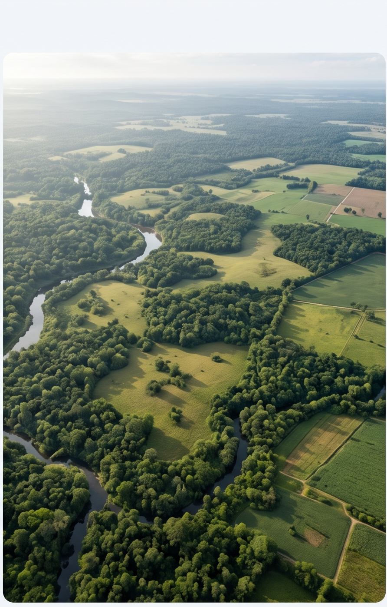

::::::::::::::::::: eg-page

:::: {#hero .eg-hero .eg-hero-tint-dark .eg-hero-right .eg-hero-top style="--eg-hero-img:url('images/nrkGraze.jpg');"}
::: eg-wrap
<!--[About us]{.eg-eyebrow}-->

# Explore our projects


:::
::::


:::::: {#study-areas .eg-section .eg-proj-map-section}
::::: eg-wrap
:::: eg-proj-map-grid

::: eg-proj-map
```{r}
#| label: prime-geospatial-map
#| echo: false
#| message: false
#| warning: false

library(leaflet)

# Project sites — coordinates are approximate placeholders around Narok
# County, Kenya. Replace lng/lat with your actual site coordinates.
sites <- data.frame(
  name = c(
    "Biodiversity assessment — Narok County",
    "Southern Patas Monkey habitat",
    "LULC change modeling — Narok",
    "LULC scenario modeling"
  ),
  lng = c(35.87, 35.80, 35.95, 35.70),
  lat = c(-1.15, -1.05, -1.20, -1.30),
  # colors match the legend dots beside the map — keep these in sync if you
  # add/remove sites
  color = c("#2E4B32", "#A97A3D", "#3D6B78", "#7A6584")
)

leaflet(height = 460) %>%
  addProviderTiles(providers$CartoDB.Positron) %>%
  setView(lng = 35.87, lat = -1.15, zoom = 8) %>%
  addCircleMarkers(
    data = sites,
    lng = ~lng, lat = ~lat,
    color = ~color,
    fillColor = ~color,
    fillOpacity = 0.9,
    radius = 9,
    stroke = TRUE, weight = 2, opacity = 1,
    popup = ~name
  )
```
:::

::: eg-proj-map-text
[Our study areas]{.eg-eyebrow}

## Where we've worked

Prime Geospatial's project work spans a range of landscapes, communities, and use cases — from biodiversity assessments to land-use change modeling for long-term planning. Each marker on the map represents an active or completed project site.

::: eg-proj-legend
::: eg-proj-legend-item
[]{.eg-proj-legend-dot style="background:#2E4B32;"}

::: eg-proj-legend-copy
**Biodiversity assessment**

[Narok County, Kenya]{}
:::
:::

::: eg-proj-legend-item
[]{.eg-proj-legend-dot style="background:#A97A3D;"}

::: eg-proj-legend-copy
**Southern Patas Monkey habitat**

[Narok County, Kenya]{}
:::
:::

::: eg-proj-legend-item
[]{.eg-proj-legend-dot style="background:#3D6B78;"}

::: eg-proj-legend-copy
**LULC change modeling**

[Narok, Kenya]{}
:::
:::

::: eg-proj-legend-item
[]{.eg-proj-legend-dot style="background:#7A6584;"}

::: eg-proj-legend-copy
**LULC scenario modeling**

[Planning applications, Narok]{}
:::
:::
:::
:::

::::
:::::
::::::


:::::: {#case-studies .eg-section .eg-proj-cases}
::::: eg-wrap
::: eg-sec-head
[Case studies]{.eg-eyebrow}

## A closer look at our work
:::

::: eg-proj-case-grid

::: eg-proj-case-card
::: eg-proj-case-photo
{loading="lazy" decoding="async"}
:::

[Biodiversity]{.eg-proj-case-tag}

### Mapping Biodiversity in Narok County, Kenya

[Geospatial Data Scientist and Landscape Ecologist specializing in arid and semi-arid landscape (ASAL) management, land-use modeling, and regenerative landscape science.]{.eg-proj-case-desc}

::: eg-proj-case-cta
[Learn more](projects_MRV.qmd#Nrk_Bio){.eg-btn .eg-btn-outline}
:::
:::

::: eg-proj-case-card
::: eg-proj-case-photo
{loading="lazy" decoding="async"}
:::

[Biodiversity]{.eg-proj-case-tag}

### Habitat Assessment for Southern Patas Monkey

[Geospatial Data Scientist and Landscape Ecologist specializing in arid and semi-arid landscape (ASAL) management, land-use modeling, and regenerative landscape science.]{.eg-proj-case-desc}

::: eg-proj-case-cta
[Learn more](projects_MRV.qmd#patas_Hab){.eg-btn .eg-btn-outline}
:::
:::

::: eg-proj-case-card
::: eg-proj-case-photo
{loading="lazy" decoding="async"}
:::

[Land-Use Change]{.eg-proj-case-tag}

### LULC Change Modeling in Narok, Kenya

[Geospatial Data Scientist and Landscape Ecologist specializing in arid and semi-arid landscape (ASAL) management, land-use modeling, and regenerative landscape science.]{.eg-proj-case-desc}

::: eg-proj-case-cta
[Learn more](projects_LULC.qmd#modeling_Nrk){.eg-btn .eg-btn-outline}
:::
:::

::: eg-proj-case-card
::: eg-proj-case-photo
{loading="lazy" decoding="async"}
:::

[Land-Use Change]{.eg-proj-case-tag}

### LULC Change Scenario Modeling for Planning

[Geospatial Data Scientist and Landscape Ecologist specializing in arid and semi-arid landscape (ASAL) management, land-use modeling, and regenerative landscape science.]{.eg-proj-case-desc}

::: eg-proj-case-cta
[Learn more](projects_LULC.qmd#scenarios_Nrk){.eg-btn .eg-btn-outline}
:::
:::

:::
:::::
::::::


:::::: {#contact .eg-section .eg-contact}
::::: eg-contact-wrap
::: eg-contact-left
## Have a landscape that needs a closer look?

Tell us what you're trying to prove, protect, or plan for. Let us discuss which layers apply.
:::

::: eg-contact-box
[EMAIL]{.eg-mono-label}

[hello\@equatorgeospatial.com](mailto:hello@equatorgeospatial.com){.eg-email}

[BASED IN]{.eg-mono-label}

[Nairobi, Kenya — serving East Africa]{.eg-email-sub}

[Send us a brief](mailto:hello@equatorgeospatial.com){.eg-btn .eg-btn-solid}
:::
:::::
::::::


:::::::::::::::::::
